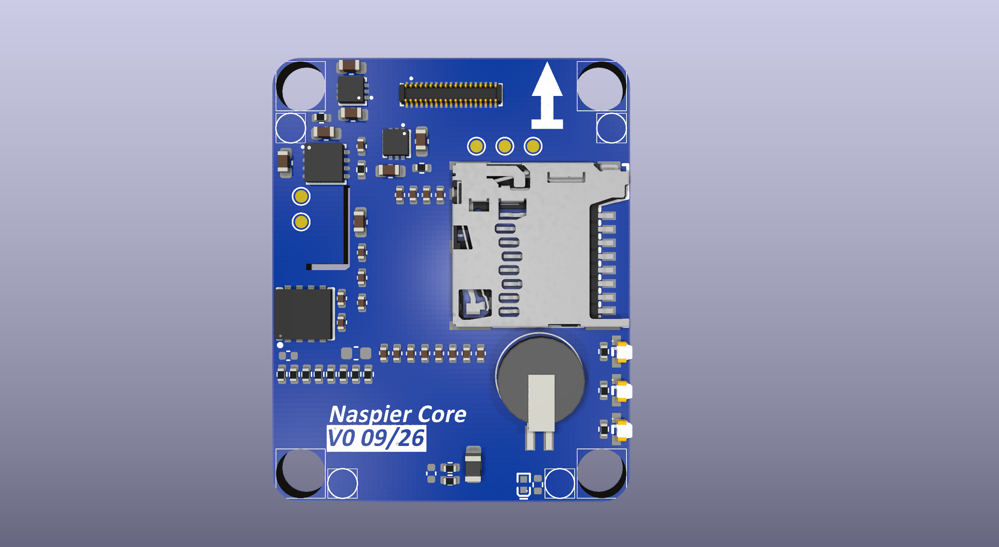

# Naspier Core

**A Pixhawk v6X-compatible flight controller core module — design study, revision REV0 VER0
(September 2026), referred to below as V0.**

Naspier Core is an autopilot core (FMU) module built around the **STM32H743IIK6**. It carries the
MCU, its power tree, storage and a reference IMU/baro set, and exposes everything through the
standard Pixhawk **100-pin + 50-pin Hirose DF40C** board-to-board connectors so it drops onto a
**Pixhawk v6X-standard carrier board**. A third **34-pin FFC connector** links it to the separate
*Naspier V2 IMU board*.


---

## ⚠️ Please read this first

**This is a design board, not a product, and not an officially used board.**

- It is a personal hardware design exercise. It has **not** been fabricated, assembled, bring-up
  tested, flight tested, certified, or used in any real vehicle.
- It is **not** an official Pixhawk / Dronecode / PX4 reference design, and it is not endorsed by,
  affiliated with, or reviewed by any of those projects.
- Nothing here is production-ready. Treat every number in this repository as *intent*, not as a
  verified result. **Do not fly it.**
- If you build from these files, you do so entirely at your own risk. See [LICENSE](LICENSE) —
  the design is provided **as is, with no warranty of any kind**.

## What is published here, and what is not

This repository is **open documentation, not open-source hardware.** It will grow as the design
progresses, but it has a deliberate boundary:

| | Status |
|---|---|
| Schematic (PDF) | ✅ Published now |
| System block diagram, connector pinouts, dimensions, 3D renders | ✅ Published now |
| **PCB layer images** — layer-by-layer plots | 🕓 Will be published once the PCB layout is finished |
| **Bill of materials** | 🕓 Will be published once the PCB layout is finished |
| **Source files** — KiCad project, schematic, board, libraries | ❌ **Will not be published** |
| **Production files** — Gerbers, drill, pick-and-place, paste/stencil, assembly data | ❌ **Will not be published** |

Enough to read, study, learn from and review the design — not enough to press "order" on it. That
is intentional, and it is not going to change for this revision.

## Why H743 and not H753?

The Pixhawk FMUv6X standard specifies the **STM32H753**, whose distinguishing feature over the H743
is its on-chip **cryptographic / hash accelerator**. Naspier Core deliberately uses the
**STM32H743IIK6** instead.

The two parts are pin-compatible in the same UFBGA-201 10×10 package and otherwise share the same
core, clocks, memory map and peripheral set — Cortex-M7 @ 480 MHz, 2 MB flash, 1 MB RAM. Dropping
the crypto block is intentional: **this board is being designed toward a different target than a
standard v6X FMU**, and the secure-element/crypto path is not part of that target. The H743 keeps
the design simpler and cheaper while leaving the v6X electrical interface untouched.

If you need FMUv6X's security features, this is the wrong board — use an H753-based module.

## Carrier board compatibility

**Naspier Core is designed to plug into v6X-based carrier boards, and doing so is safe.** X1
(100-pin) and X2 (50-pin) follow the Pixhawk v6X pinout, so on a classic Pixhawk 6X carrier the
module presents itself like any other v6X core. Full tables: **[docs/pinout.md](docs/pinout.md)**.

| Connector | Contents | On a classic Pixhawk 6X carrier |
|---|---|---|
| **X1 — 100P** | 5 V system power, PWM `FMU_CH1`–`CH8`, I2C1–I2C4, CAN1 + CAN2, UART1–UART8, USB, SWD, ADC sense, power-module select A/B/C, safety switch, buzzer | Works as expected |
| **X2 — 50P** | 100BASE-T RMII Ethernet, external SPI6 (2 × CS, reset, 2 × DRDY), `SPIX_SYNC`, `PG6` | Works as expected |
| **X2 — 15 reserved pins** | Positions the newer **v6X-RT** update assigns to `FMU_CH9`–`CH12`, `CAN3`, `SPARE09`–`SPARE15`, `ETH_RX_ER`, `ETH_PHY_nINT`, `PH11` | **Left unconnected on this module.** Nothing is driven into them, so there is no conflict on a v6X *or* a v6X-RT carrier |
| **X3 — 34P FFC** | Sensor link to the Naspier V2 IMU board — **non-standard pinout** | Does not connect to the carrier at all |

Two consequences worth stating plainly:

- **V0 does not bring out PWM channels 9–12 or CAN3.** Those are v6X-RT additions. The schematic
  labels the pin positions so the intent is on record, but they are no-connects on this revision.
  If your airframe needs more than 8 FMU PWM channels from the core, this board does not provide
  them yet.
- **X3 is the one genuinely non-standard interface.** It is a private 34-pin link carrying SPI2,
  SPI3, I2C4, three switched sensor rails and a heater line to the Naspier V2 IMU board. It is not
  interchangeable with a third-party IMU board. It does not affect carrier compatibility, because
  X3 never faces the carrier.

### Upcoming — PAB standard carrier board

A companion carrier board is in design. It is built to the **Pixhawk Autopilot Bus** standard
([DS-010](https://github.com/pixhawk/Pixhawk-Standards/blob/master/DS-010%20Pixhawk%20Autopilot%20Bus%20Standard.pdf)) —
the same board-to-board interface that standard v5X and v6X modules use.

Because it targets the bus standard rather than one specific module, it is intended to accept a
**standard v6X or v5X autopilot module** just as readily as **Naspier Core**. Naspier Core is not a
prerequisite for it, and it is not a prerequisite for Naspier Core.

It is early — nothing about it is published yet, and it will get its own documentation once the
design is further along.

---

## Specifications

### Processor

| | |
|---|---|
| MCU | STM32H743IIK6, ARM Cortex-M7, 480 MHz |
| Package | UFBGA-201, 10 × 10 mm, 0.65 mm pitch |
| Flash / RAM | 2 MB (2M × 8) / 1 MB |
| Main oscillator | 16.000 MHz (ABM8G-16.000MHZ-18-D2Y-T) |
| RTC oscillator | 32.768 kHz (SC32S-7PF20PPM) |
| RTC backup | MS621FE-FL11E rechargeable coin cell on the VBAT line; charge path (D1, R2) is do-not-place in this revision |
| Status LEDs | Discrete red / green / blue |

### Sensors and storage

On the core module itself:

| Part | Function | Bus | Notes |
|---|---|---|---|
| **ICM-45686** | IMU — accelerometer + gyroscope | SPI1 | `SPI1_nCS1`, data-ready on `SPI1_DRDY1`; powered from `VDD_SENSOR_BUS_1` |
| **MS5611** | Barometer | I2C3 | CSB strapped to select I2C mode; on `VDD_SENSOR_BUS_1` |
| **FM25V02A** | FRAM — parameter storage | SPI5 | Non-volatile, no write-endurance limit in practice; on `VDD_3V3_AUX` |
| **AT24C64D** | EEPROM — board ID / config | I2C3 | Address strapped to **0x50**; on `VDD_3V3_AUX` |
| **503398-1892** | microSD socket, push-in / push-out | SDMMC2, 4-bit | On its own switchable `VDD_SD_CARD` rail |

Across the 34-pin FFC, on the **Naspier V2 IMU board** (separate design):

| Part | Function | Bus |
|---|---|---|
| LSM6DSV | IMU2 | SPI2 |
| BMI088 | IMU3 — separate accel and gyro dies, two chip selects | SPI3 |
| BMP581 | Barometer 2 — interrupt line only on this connector | I2C4 |
| RM3100 | Magnetometer — data-ready line only on this connector | I2C4 |
| — | Sensor heater | `HEATER` drive line |

The 1.5 kΩ pull-ups for all four I2C buses live on the core module, on `VDD_REG_FMU_3V3`.

### Power structure

Input is **5 V from the carrier** (`VDD_5V_SYS`, four pins on X1). Everything downstream is split so
that no single rail takes the whole board down, and so each sensor domain can be power-cycled
independently — the standard requirement for autopilot sensor recovery.

```
VDD_5V_SYS ──► L1  1 µH / 3.1 A / 55 mΩ ──► VDD_5V_FILTERED
                  (CIGT201208EH1R0MNE)           │
        ├─► U5  MCP1727T-3302E/MF ──► VDD_REG_FMU_3V3   main FMU rail   
        │         └─► NFM18PC104R1C3D ──► FMU_3V3 digital / FMU_3V3A analog
        ├─► U7  MCP1727T-3302E/MF ──► VDD_3V3_AUX       aux rail, instead of the FMU rail for extensions
        ├─► U6  LDL212PV33R ────────► VDD_SENSOR_BUS_1  on-board ICM-45686 + MS5611
        ├─► U8  LDL212PV33R ────────► VDD_SENSOR_BUS_2  → Imu Board Connector
        ├─► U9  LDL212PV33R ────────► VDD_SENSOR_BUS_3  → Imu Board Connector
        ├─► U10 LDL212PV33R ────────► VDD_SENSOR_BUS_4  → Imu Board Connector
        ├─► U12 LDL212PV33R ────────► VDD_SD_CARD       microSD
        └─► divider ────────────────► SCALED_V5         5 V input monitoring
```

> **Note — why L1 is there.** The 1 µH inductor is placed to make the input rail more robust. Many
> off-the-shelf BEC modules do **not** hold their output voltage steady under hard conditions —
> aggressive manoeuvring, heat, high current draw and so on — and sag below nominal, for example
> 5.0 V dropping to 4.6 V on under-peaks. L1 is there only to slow and filter that ripple.
>
> It is the **only** part added on the input power path. Regulating the 4.8–6 V input range itself
> is not this board's job — that belongs to a **power mux on the carrier board**.

Design points:

- **Every sensor rail is independently switched** — `VDD_3V3_SENSORS1_EN` … `SENSORS4_EN` and
  `VDD_3V3_SD_CARD_EN` — so firmware can hard-reset a hung sensor or the SD card.
- **Every sensor rail is independently monitored** — each LDL212 output goes through a 10 kΩ / 10 kΩ
  divider to `SCALED_VDD_3V3_SENSORS1..4` and back into the MCU's ADC.
- **Carrier-side rail control** is brought out on X1: `VDD_5V_PERIPH_nEN` / `_nOC`,
  `VDD_5V_HIPOWER_nEN` / `_nOC`, `VDD_3V3_SPEKTRUM_POWER_EN`, and the `nPOWER_IN_A/B/C`
  power-module select lines with `ADC1_3V3` / `ADC1_6V6` sensing.

### Interfaces exposed to the carrier

- **PWM / timer outputs:** `FMU_CH1`–`FMU_CH8` (X1)
- **Serial:** UART1 (GPS1), UART2 (TELEM3), UART3 (debug), UART4, UART5 (TELEM2),
  UART6 (RC input), UART7 (TELEM1), UART8 (GPS2) — with RTS/CTS on TELEM1/2/3
- **CAN:** CAN1, CAN2 (X1)
- **Ethernet:** 100BASE-T RMII — MDIO, MDC, REF_CLK, CRS_DV, RXD0/1, TXD0/1, TX_EN, ETH_POWER_EN
  (the PHY lives on the carrier)
- **I2C:** I2C1 (GPS1 mag/LED/PM1), I2C2 (GPS2 mag/LED/PM2), I2C3 (on-board baro/EEPROM, external),
  I2C4 (FMU, to the IMU board)
- **USB:** `USB_D_P` / `USB_D_N` + `VBUS_SENSE`
- **SPI6:** external bus — SCK / MISO / MOSI, two chip selects, reset, two data-ready lines
- **Debug:** `FMU_SWDIO` / `FMU_SWCLK` routed to X1. The board also carries a debug test-point
  group — TP10 (`VDD_REG_FMU_3V3`), TP13 (`FMU_SWDIO`), TP14 (`FMU_SWCLK`), TP16 (`FMU_nRST`),
  TP17 (`GND`) — plus TP6–TP9 on the unused SPI4 expansion bus. An 8-pin GH1.25 connector (CN4) is
  drawn alongside them, annotated in the schematic as serving that debug/programming point group.
- **Other:** buzzer, safety switch + LED, `nARMED`, `FMU_nRST`, `FMU_CAP1`, `FMU_PPM_INPUT`,
  `SPIX_SYNC`, hardware-revision sense lines, RGB status LEDs (discrete red / green / blue)

Full pin-by-pin tables: **[docs/pinout.md](docs/pinout.md)**.

### PCB and fabrication

| | |
|---|---|
| Outline | 29.00 × 36.00 mm |
| Stack-up | **12-layer FR4**, 0.5 Oz / 1 Oz copper, ≈**1.6 mm** finished thickness |
| Soldermask | **Blue**, top and bottom, vias tented |
| Mounting | Four corner mounting holes (2.2mm Diameter holes) |
| Connectors | X1 DF40C-100DP-0.4V(58) · X2 DF40C-50DP-0.4V(58) · X3 BM20B-0.8-34DP-0.4V-51 |
| EDA tool | KiCad 10 |
| Fabrication Target | JLCPCB, NextPCB |


**Component placement follows DS-012.** The board outline, the positions of X1 and X2, the mounting
holes and the keep-out zones are taken from the positioning given in
**[DS-012 — Pixhawk Autopilot v6X Standard](https://github.com/pixhawk/Pixhawk-Standards/blob/master/DS-012%20Pixhawk%20Autopilot%20v6X%20Standard.pdf)**,
not chosen freely. That is what makes the module mechanically as well as electrically droppable onto
a v6X carrier: the connectors land where a v6X carrier expects them, and the mounting holes line up
with the carrier's standoffs. Everything else on the board is placed around those fixed points.

The one piece not governed by DS-012 is **X3**, the 34-pin FFC to the Naspier V2 IMU board — the
standard does not define it, so its position is ours to choose, constrained by the IMU board stack
rather than by the carrier.

**Impedance control.** The RMII Ethernet group is routed inside an impedance-controlled zone
targeting **50 Ω single-ended**, marked as such on the connectors sheet. Digital and power routing
are kept on their own layers, away from that zone.

**The BGA fanout is the open problem.** The STM32H743IIK6 is a **UFBGA-201 at 0.65 mm pitch** in a
10 × 10 mm body. At that pitch only the outermost ball rows escape cleanly with conventional dogbone
vias; the inner rows do not. Two approaches are on the table and **the choice has not been made
yet**:

| Approach | How it works | Trade-off |
|---|---|---|
| **1 — Pad depopulation + through-hole fanout** | Remove selected SD-Card Receptor pads, leaving those pad unconnected, to open escape channels — then fan out with ordinary plated-through vias | Standard, cheap process with wide fab availability. Costs you some balls, so certain peripherals become unusable, and via stubs stay in the stack-up, The SD-Card connector goes less stable on this way. |
| **2 — Full HDI** | Microvia / via-in-pad fanout under the BGA, with HDI vias used across the whole board | Keeps all 201 balls usable and gives far better signal integrity and plane continuity. Significantly higher cost, longer lead time, fewer capable fabs |

This gets resolved during layout, and whichever wins will be documented here.

---

## Renders

| Top | Bottom |
|---|---|
|  |  |



## Repository contents

```
docs/
├── pinout.md                        X1 / X2 / X3 pin tables, generated from the schematic netlist
├── schematic/
│   └── Naspier-Core-Schematic.pdf   Full 5-sheet schematic
└── images/
    ├── dimensions.png               Board outline with dimensions
    ├── rendered-top.png             3D render, top
    ├── rendered-bottom.png          3D render, bottom
    └── top-bottom-layout.png        Layout, both sides
```

The schematic PDF covers, in order: system block diagram · H743 base (MCU, crystals, LEDs, RTC) ·
connectors (X1/X2/X3, debug, SPI4 expansion) · on-board elements (IMU, baro, FRAM, EEPROM, SD,
I2C pull-ups) · power stage.

> **Editable KiCad source files are not published in this repository** — see
> [what is published here, and what is not](#what-is-published-here-and-what-is-not).

## Status and roadmap

| | |
|---|---|
| Revision | **REV0 VER0** — board ID `NASPIER_CORE_REV0_VER0` |
| Design started | 2026-08-08 |
| Last updated | 2026-09-13 |
| Designer | Ahmet Vapurcu (**naspaw**) |
| Schematic | Drafted, review pending |
| PCB layout | **Not finished** — fanout strategy undecided |
| Mechanical | **Not finished** — outline, hole pattern and stack clearance still moving |
| Fabricated | No |
| Tested | No |
| Firmware | None — no PX4/ArduPilot board target exists for this design |

### Upcoming work

What is queued for this design, roughly in order. This list is the honest state of the project —
none of it is done yet.

| # | Task | What it covers |
|---|---|---|
| 1 | **Schematic review** | Full pass over the V0 sheets before any layout work is trusted |
| 2 | **Fanout selection** | Decide the H743 BGA escape strategy: pad depopulation with through-hole fanout, or full HDI across the board |
| 3 | **Component placement review** | Check placement against the DS-012 positions for v6X and the mechanical tolerances they imply |
| 4 | **Mounting hole design** | Hole pattern, keep-outs and stack clearance |
| 5 | **IMU board assembly design** | How Naspier Core and the Naspier V2 IMU board stack and mate — including whether the IMU board needs mounting holes of its own, or is carried by the FFC and the core board alone |
| 6 | **Stack-up-driven routing** | Place the RMII group on its 50 Ω single-ended impedance layer; separate digital and power routing onto their own layers |
| 7 | **BOM availability check** | Confirm every line is actually sourceable before the design is frozen |
| 8 | **Further design checks** | Remaining private verification passes |
| 9 | **Publish layer images + BOM** | Once layout is complete — see the release policy above |

This README will grow as the design does.

## Feedback

**Design review is the point of publishing this.** V0 has not been fabricated or tested, so a second
pair of eyes on the schematic is worth more to this project than anything else. If you spot a
mistake, say so — bluntly is fine.

Particularly useful:

- **Schematic errors** — wrong part, wrong value, missing pull-up or decoupling, a net that does not
  go where the name says it does
- **v6X compliance** — anything on X1 or X2 that does not match
  [DS-012](https://github.com/pixhawk/Pixhawk-Standards/blob/master/DS-012%20Pixhawk%20Autopilot%20v6X%20Standard.pdf),
  or a carrier board this module would not actually mate with
- **BGA fanout** — experience with 0.65 mm UFBGA-201 escape routing either way, pad depopulation or
  full HDI, and what your fab actually charged for it
- **Power tree** — rail sequencing, regulator choice, current headroom, monitoring divider values
- **Layout and mechanics** — placement against the DS-012 positions, mounting hole pattern, keep-out
  and stack clearance to the IMU board
- **Sourcing** — a part here that is end-of-life, hard to get, or has a better-stocked equivalent

Two things that are settled and not up for discussion: the choice of **H743 over H753**
(see [above](#why-h743-and-not-h753)), and the fact that **source and production files are not
published**. Everything else is open.

**Contact:** naspawpc@gmail.com

## License

Copyright © 2026 **Ahmet Vapurcu** (**naspaw**). When attributing this design, use that name and a
link back to this repository.

The Naspier Core design documentation in this repository is released under
**[Creative Commons Attribution-ShareAlike 3.0 Unported (CC BY-SA 3.0)](LICENSE)** — the same
license the Pixhawk project uses for its hardware reference designs.

You may use, share, modify and build on **the documents published here**, including commercially,
provided that you **give attribution** and **share any derivative under the same license**.

Note the scope: the license covers what is in this repository. Source and production files are not
published (see [above](#what-is-published-here-and-what-is-not)), so this is open documentation
rather than open-source hardware in the OSHWA sense.

Trademarks, part names and the Pixhawk standards referenced here belong to their respective owners.

## Acknowledgements

Built against the [Pixhawk open standards](https://pixhawk.org/standards/) published by the Pixhawk
Special Interest Group and coordinated by the Dronecode Foundation.
