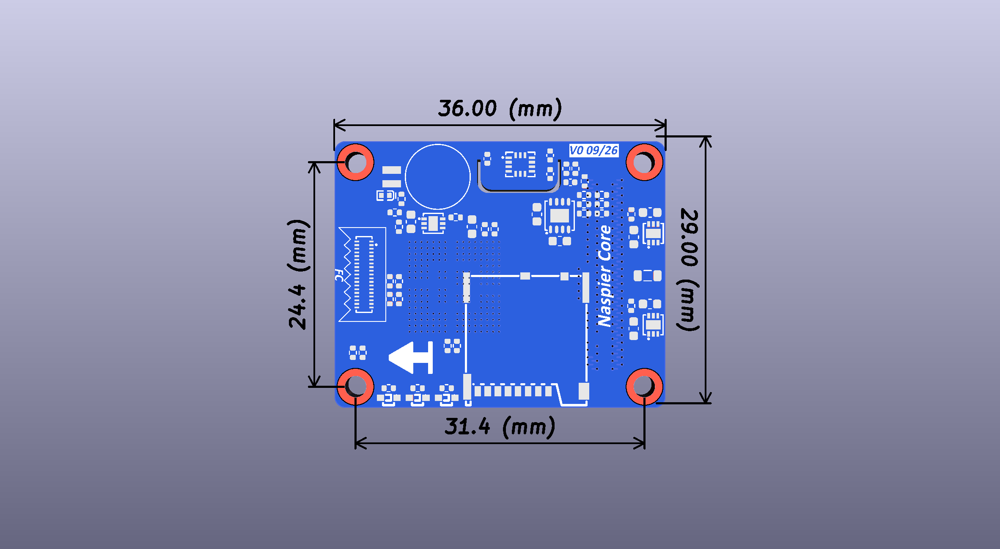
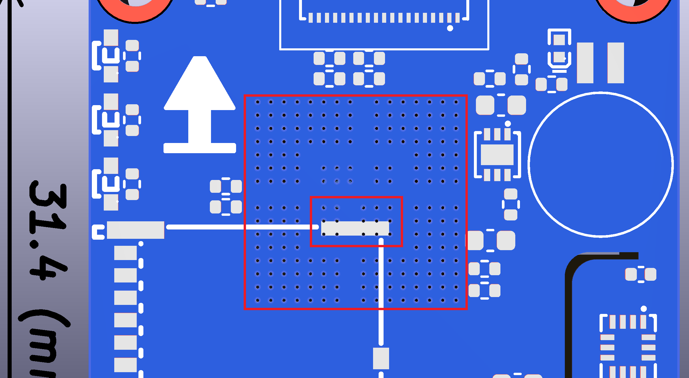
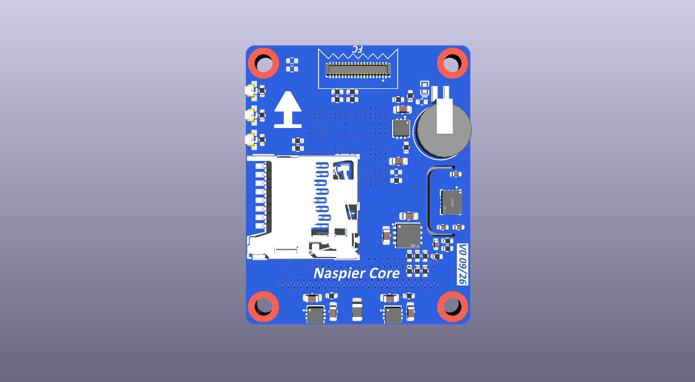
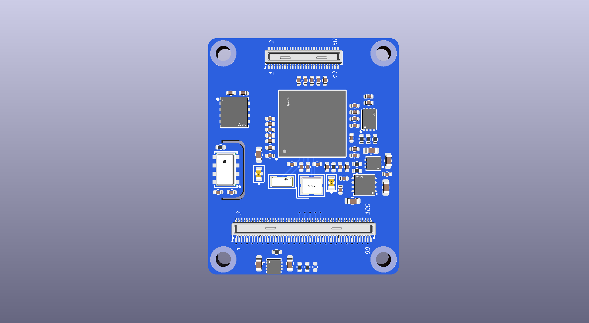

# Naspier Core

**A Pixhawk v6X-compatible flight controller core module — design study, revision REV0 VER0
(September 2026), referred to below as V0.**

Naspier Core is an autopilot core (FMU) module built around the **STM32H743IIK6**. It carries the
MCU, its power tree, storage and a reference IMU/baro set, and exposes everything through the
standard Pixhawk **100-pin + 50-pin Hirose DF40C** board-to-board connectors so it drops onto a
**Pixhawk v6X-standard carrier board**. A third **34-pin FFC connector** links it to the separate
*Naspier V2 IMU board*.



---

## ⚠️ Please read this first

**This is a design board, not a product, and not an officially used board.**

- It is a personal hardware design exercise. It has **not** been fabricated, assembled, bring-up
  tested, flight tested, certified, or used in any real vehicle.
- It is **not** an official Pixhawk / Dronecode / PX4 reference design, and it is not endorsed by,
  affiliated with, or reviewed by any of those projects.
- Nothing here is production-ready. Treat every number in this repository as *intent*, not as a
  verified result. **Do not fly it.**
- If you build from these files, you do so entirely at your own risk. See [LICENSE](LICENSE) —
  the design is provided **as is, with no warranty of any kind**.

## What is published here, and what is not

This repository is **open documentation, not open-source hardware.** It will grow as the design
progresses, but it has a deliberate boundary:

| | Status |
|---|---|
| Schematic (PDF) — core module and Naspier V2 IMU board | ✅ Published now |
| System block diagram (preliminary), connector pinouts, dimensions, 3D renders | ✅ Published now |
| **PCB layer images** — layer-by-layer plots | 🕓 Will be published once the PCB layout is finished |
| **Bill of materials** | 🕓 Will be published once the PCB layout is finished |
| **Source files** — KiCad project, schematic, board, libraries | ❌ **Will not be published** |
| **Production files** — Gerbers, drill, pick-and-place, paste/stencil, assembly data | ❌ **Will not be published** |

Enough to read, study, learn from and review the design — not enough to press "order" on it. That
is intentional, and it is not going to change for this revision.

## Why H743 and not H753?

Pixhawk v6X flight controllers ship with the **STM32H753** (DS-012 itself only calls for an STM32H7).
The H753's distinguishing feature over the H743 is its on-chip **cryptographic / hash accelerator**. Naspier Core deliberately uses the
**STM32H743IIK6** instead.

The two parts are pin-compatible in the same UFBGA-201 10×10 package and otherwise share the same
core, clocks, memory map and peripheral set — Cortex-M7 @ 480 MHz, 2 MB flash, 1 MB RAM. Dropping
the crypto block is intentional: **this board is being designed toward a different target than a
standard v6X FMU**, and the secure-element/crypto path is not part of that target. The H743 keeps
the design simpler and cheaper while leaving the v6X electrical interface untouched.

**Supply is the other reason.** H753 stock has been thin, and when distributor inventory runs out
the factory lead times are long. Using the H743 means this board **does not depend on H753
availability**: if H753 stock is gone, the build carries on with the H743 and simply goes without
the crypto accelerator. Nothing else about the board changes.

### ⚠️ If you need FMUv6X's security features, this is the wrong board — use an H753-based module.

## Carrier board compatibility

Naspier Core plugs into standard **Pixhawk v6X carrier boards**. X1 and X2 follow the v6X pinout.
Full tables: **[docs/pinout.md](docs/pinout.md)**.

| Connector | Contents |
|---|---|
| **X1 — 100P** | Power, PWM 1–8, I2C, CAN, UART, USB, SWD, ADC |
| **X2 — 50P** | Ethernet (RMII), SPI6. The v6X-RT extra pins are left unconnected. |
| **X3 — 34P FFC** | Link to the Naspier V2 IMU board. Custom pinout, not used by the carrier. |

PWM 9–12 and CAN3 (v6X-RT additions) are not available on this revision.

### Upcoming: PAB carrier board

A carrier board built to the **Pixhawk Autopilot Bus** standard
([DS-010](https://github.com/pixhawk/Pixhawk-Standards/blob/master/DS-010%20Pixhawk%20Autopilot%20Bus%20Standard.pdf))
is in design. It will accept standard v5X / v6X modules as well as Naspier Core.

---

## Specifications

### Processor

| | |
|---|---|
| MCU | STM32H743IIK6, ARM Cortex-M7, 480 MHz |
| Package | UFBGA-201, 10 × 10 mm, 0.65 mm pitch |
| Flash / RAM | 2 MB (2M × 8) / 1 MB |
| HS oscillator | 16.000 MHz |
| LS oscillator | 32.768 kHz  |
| RTC backup | MS621FE-FL11E rechargeable coin cell on the VBAT line; charge path (D1, R2) is do-not-place in this revision |
| Status LEDs | Discrete red / green / blue |

### Sensors and storage

On the core module:

| Part | Function | Bus | VDD bus |
|---|---|---|---|
| ICM-45686 | IMU1 | SPI1 | `VDD_SENSOR_BUS_1` |
| MS5611 | Barometer 1 | I2C3 | `VDD_SENSOR_BUS_1` |
| FM25V02A | FRAM | SPI5 | `VDD_3V3_AUX` |
| AT24C64D | EEPROM | I2C3 | `VDD_3V3_AUX` |
| 503398-1892 | microSD | SDMMC2 | `VDD_SD_CARD` |

On the Naspier V2 IMU board (via the 34-pin FFC):

| Part | Function | Bus | VDD bus |
|---|---|---|---|
| LSM6DSV32X | IMU2 | SPI2 | `VDD_SENSOR_BUS_2` |
| BMI088 | IMU3 | SPI3 | `VDD_SENSOR_BUS_3` |
| BMP581 | Barometer 2 | I2C4 | `VDD_SENSOR_BUS_2` |
| RM3100 | Magnetometer | I2C4 | `VDD_SENSOR_BUS_4` |
| AT24C64D | EEPROM | I2C4 | `VDD_SENSOR_BUS_4` |
| AO3400A | Heater driver | — | `VDD_5V_SYS` |

### Power structure

Input is **5 V from the carrier** (`VDD_5V_SYS`, four pins on X1). Everything downstream is split so
that no single rail takes the whole board down, and so each sensor domain can be power-cycled
independently — the standard requirement for autopilot sensor recovery.


> **Note — why L1 is there.** L1, a 1 µH inductor on the `VDD_5V_SYS` input, is placed to make the input rail more robust. Many
> off-the-shelf BEC modules do **not** hold their output voltage steady under hard conditions —
> aggressive manoeuvring, heat, high current draw and so on — and sag below nominal, for example
> 5.0 V dropping to 4.6 V on under-peaks. L1 is there only to slow and filter that ripple.
>
> It is the **only** part added on the input power path. Regulating the 4.8–6 V input range itself
> is not this board's job — that belongs to a **power mux on the carrier board**.

Design points:

- **Every sensor rail is independently switched** — `VDD_3V3_SENSORS1_EN` … `SENSORS4_EN` and
  `VDD_3V3_SD_CARD_EN` — so firmware can hard-reset a hung sensor or the SD card.
- **Every sensor rail is independently monitored** — each LDL212 output goes through a 10 kΩ / 10 kΩ
  divider to `SCALED_VDD_3V3_SENSORS1..4` and back into the MCU's ADC.
- **Carrier-side rail control** is brought out on X1: `VDD_5V_PERIPH_nEN` / `_nOC`,
  `VDD_5V_HIPOWER_nEN` / `_nOC`, `VDD_3V3_SPEKTRUM_POWER_EN`, and the `nPOWER_IN_A/B/C`
  power-module select lines with `ADC1_3V3` / `ADC1_6V6` sensing.

### Interfaces exposed to the carrier

- **PWM / timer outputs:** `FMU_CH1`–`FMU_CH8` (X1)
- **Serial:** UART1 (GPS1), UART2 (TELEM3), UART3 (debug), UART4, UART5 (TELEM2),
  UART6 (RC input), UART7 (TELEM1), UART8 (GPS2) — with RTS/CTS on TELEM1/2/3
- **CAN:** CAN1, CAN2 (X1)
- **Ethernet:** 100BASE-T RMII — MDIO, MDC, REF_CLK, CRS_DV, RXD0/1, TXD0/1, TX_EN, ETH_POWER_EN
  (the PHY lives on the carrier)
- **I2C:** I2C1 (GPS1 mag/LED/PM1), I2C2 (GPS2 mag/LED/PM2), I2C3 (on-board baro/EEPROM, external).
  I2C4 goes only to the IMU board over X3, not to the carrier.
- **USB:** `USB_D_P` / `USB_D_N` + `VBUS_SENSE`
- **SPI6:** external bus — SCK / MISO / MOSI, two chip selects, reset, two data-ready lines
- **Debug:** `FMU_SWDIO` / `FMU_SWCLK` routed to X1. The board also carries a debug test-point
  group.
- **Other:** buzzer, safety switch + LED, `nARMED`, `FMU_nRST`, `FMU_CAP1`, `FMU_PPM_INPUT`,
  `SPIX_SYNC`, hardware-revision sense lines, RGB status LEDs (discrete red / green / blue)

Full pin-by-pin tables: **[docs/pinout.md](docs/pinout.md)**.

### PCB and fabrication

| | |
|---|---|
| Outline | 29.00 × 36.00 mm |
| Stack-up | **12-layer FR4**, 0.5 Oz / 1 Oz copper, ≈**1.6 mm** finished thickness |
| Soldermask | **Blue**, top and bottom, vias tented |
| Mounting | Four corner holes, **2.3 mm drill / 4.0 mm pad**, on a **31.4 × 24.4 mm** pattern |
| Vias | BGA fanout **0.15 / 0.32 mm** (drill / diameter), filled and capped · all other signal vias **0.2 / 0.42 mm** · all through-hole, no microvias |
| Connectors | X1 DF40C-100DP-0.4V(58) · X2 DF40C-50DP-0.4V(58) · X3 BM20B-0.8-34DP-0.4V-51 |
| EDA tool | KiCad 10 |
| Fabrication Target | JLCPCB, NextPCB |


**Component placement follows DS-012.** The board outline, the positions of X1 and X2, the mounting
holes and the keep-out zones are taken from the positioning given in
**[DS-012 — Pixhawk Autopilot v6X Standard](https://github.com/pixhawk/Pixhawk-Standards/blob/master/DS-012%20Pixhawk%20Autopilot%20v6X%20Standard.pdf)**,
not chosen freely. That is what makes the module mechanically as well as electrically droppable onto
a v6X carrier: the connectors land where a v6X carrier expects them, and the mounting holes line up
with the carrier's standoffs. Everything else on the board is placed around those fixed points.

The one piece not governed by DS-012 is **X3**, the 34-pin FFC to the Naspier V2 IMU board — the
standard does not define it, so its position is ours to choose, constrained by the IMU board stack
rather than by the carrier.

**Impedance control.** The RMII Ethernet group is routed inside an impedance-controlled zone
targeting **50 Ω single-ended**, marked as such on the connectors sheet. Digital and power routing
are kept on their own layers, away from that zone.

**Component placement was revised for signal routing.** Components were moved to shorten and
untangle the signal paths. The STM32H743 is now deliberately placed **off the board's centre line**.
This gives the BGA enough free space on both sides for a through-hole fanout, so the board **does
not need HDI vias**. It breaks the symmetry of the earlier placement, but the H743 is the only part
moved off-axis. X1, X2 and the mounting holes stay on their DS-012 positions.

### BGA fanout — decided: fine-pitch through-hole dogbone

The STM32H743IIK6 is a **UFBGA-201 at 0.65 mm pitch** in a 10 × 10 mm body, mounted on the
**bottom side**. Two options were on the table: pad depopulation with through-hole fanout, or full
HDI. **Neither was needed.** The fanout is **complete**:

- **Every one of the 201 balls** is fanned out with a dogbone via. Each via sits on the diagonal
  between four balls, 0.46 mm from its own ball.
- **BGA vias are 0.15 mm drill / 0.32 mm diameter**, plated-through Top to Bottom, **filled and
  capped**. There are no microvias, no blind or buried vias, and no via-in-pad on the balls.
- **All other signal vias are 0.2 / 0.42 mm.**
- The fanout escapes on the standard **12-layer, 1.6 mm** stack-up. No balls are depopulated, so
  every peripheral stays usable.

**Routing after the fanout.** Power and the RMII Ethernet group are routed separately, so neither
disturbs the other digital signals. Signal routing from the BGA out to its peripherals has started.

The trade-off that remains is the one standard through-hole vias always carry: via stubs stay in the
stack-up, and the 0.15 mm drill through 1.6 mm is close to a 10.7 : 1 aspect ratio. Both have to be
confirmed against the chosen fab's capability before ordering.

**Open point — microSD shield tab over the fanout.** The H743 is on the bottom and the microSD socket
(CN1) is on the top, directly above it. One of the socket's ground shield tabs (pad 11,
0.7 × 3.33 mm) lands on **10 of the BGA fanout vias**. All 10 are `GND`, the same net as the tab, so
there is no short and no clearance error. The concern is assembly: those vias must be reliably filled
and capped, or solder will wick into them during reflow and weaken the socket's mechanical anchor.



---

## Renders

| Top | Bottom |
|---|---|
|  |  |

## Repository contents

```
docs/
├── pinout.md                        X1 / X2 / X3 pin tables, generated from the schematic netlist
├── schematic/
│   └── Naspier-Core-Schematic.pdf   Schematic, core module + Naspier V2 IMU board
└── images/
    ├── dimensions.png               Board outline, mounting-hole pattern and dimensions
    ├── rendered-top.png             3D render, top
    ├── rendered-bottom.png          3D render, bottom (H743, X1, X2)
    └── bga-fanout-sd-shield.png     microSD shield tab over the BGA fanout
```

The schematic PDF covers, in order:

1. System block diagram (**preliminary**, still being updated)
2. H743 base: MCU, decoupling, crystals, LEDs, RTC, debug test points,
3. On-board elements: IMU, baro, FRAM, EEPROM, microSD, I2C pull-ups
4. Power stage
5. Connectors: X1, X2, X3
6. Naspier V2 IMU board: IMU2, IMU3, baro 2, magnetometer, heater, EEPROM, X3 mate
7. Power bus index

The last two pages are placeholders for the carrier board and are still empty.

> **Editable KiCad source files are not published in this repository** — see
> [what is published here, and what is not](#what-is-published-here-and-what-is-not).

## Status and roadmap

| | |
|---|---|
| Revision | **REV0 VER0** — board ID `NASPIER_CORE_REV0_VER0` |
| Design started | 2026-08-08 |
| Last updated | 2026-09-19 |
| Designer | Ahmet Vapurcu (**naspaw**) |
| Schematic | Core drafted, IMU board base schematic added; block diagram preliminary; review pending |
| PCB layout | **In progress**: 12 layers; placement revised, BGA fanout complete; power and RMII routed apart from digital signals; routing from the BGA to its peripherals started |
| Mechanical | Mounting holes set (2.3 / 4.0 mm, 31.4 × 24.4 mm); stack clearance to the IMU board, mechanical drawing and IMU vibration isolation still open |
| Drawings | Core board and IMU board signal drawings, IMU ↔ Core FFC cable drawing — not started |
| Fabricated | No |
| Tested | No |
| Firmware | None — no PX4/ArduPilot board target exists for this design |

### Upcoming work

What is queued for this design, roughly in order. This list is the honest state of the project.

| # | Task | State | What it covers |
|---|---|---|---|
| 1 | **Schematic review** | Open | Full pass over the V0 sheets, now including the IMU board |
| 2 | **Fanout selection** | ✅ Done | Through-hole dogbone, 0.15 / 0.32 mm vias, all 201 balls, 12-layer 1.6 mm |
| 3 | **Component placement review** | 🔄 In progress | Revised for signal routing; H743 moved off-centre; check against DS-012 positions |
| 4 | **Mounting hole design** | 🔄 In progress | Holes set at 2.3 / 4.0 mm on 31.4 × 24.4 mm; keep-outs and stack clearance still open |
| 5 | **microSD shield tab over fanout** | Open | Confirm filled + capped vias with the fab, or move the socket off the 10 GND vias |
| 6 | **IMU board assembly design** | Open | How Naspier Core and the Naspier V2 IMU board stack and mate, including whether the IMU board needs mounting holes of its own |
| 7 | **Stack-up-driven routing** | 🔄 In progress | Power and RMII routed apart from digital signals; BGA-to-peripheral signal routing started; RMII on its 50 Ω single-ended layer |
| 8 | **System block diagram** | Open | First version published; still needs updates |
| 9 | **Core board signal drawing** | Open | Signal-flow drawing of the core module: H743 to on-board sensors, storage, switched power rails and X1 / X2 / X3 |
| 10 | **IMU board signal drawing** | Open | Signal-flow drawing of the Naspier V2 IMU board: IMU2, IMU3, baro 2, magnetometer, heater and EEPROM to the X3 mate |
| 11 | **FFC cable drawing (IMU ↔ Core)** | Open | FFC between Core and the IMU board: pin-to-pin map, length, contact side / orientation, stiffeners |
| 12 | **Mechanical drawing** | Open | Assembly drawing of Naspier Core and the IMU board: outlines, stack heights, IMU board position, fasteners |
| 13 | **Vibration isolation mechanics** | Open | Damped mount for the IMU board: isolator type and placement, travel allowance, FFC slack so the cable does not short-circuit the isolation |
| 14 | **BOM availability check** | ⚠️ Open — issues found | Confirm every line is actually sourceable before the design is frozen. The H743 and BMI088 are already running short; see [supply status](#supply-status) |
| 15 | **Further design checks** | Open | Remaining private verification passes |
| 16 | **Publish layer images + BOM** | Open | Once layout is complete; see the release policy above |

### Supply status

The market can change in the time it takes to lay out a board, and this design shows it. When the project
started on 2026-08-08, both of the parts below were readily available. **As of 2026-09-19, both are close
to out of stock** at DigiKey and at other distributors:

| Part | Role | At project start | Now |
|---|---|---|---|
| **STM32H743IIK6** | MCU | In stock | ⚠️ Close to out of stock |
| **BMI088** | IMU3, on the IMU board | In stock | ⚠️ Close to out of stock |

This also affects the [H743 vs H753](#why-h743-and-not-h753) reasoning. Choosing the H743 removed the
dependency on H753 stock, but it does not protect against the H743 itself running short. Before the
design is frozen, each of these parts needs one of two outcomes: a confirmed source, or a
drop-in / footprint-compatible alternative.

This README will grow as the design does.

## Feedback

**Design review is the point of publishing this.** V0 has not been fabricated or tested, so a second
pair of eyes on the schematic is worth more to this project than anything else. If you spot a
mistake, say so — bluntly is fine.

Particularly useful:

- **Schematic errors** — wrong part, wrong value, missing pull-up or decoupling, a net that does not
  go where the name says it does
- **v6X compliance** — anything on X1 or X2 that does not match
  [DS-012](https://github.com/pixhawk/Pixhawk-Standards/blob/master/DS-012%20Pixhawk%20Autopilot%20v6X%20Standard.pdf),
  or a carrier board this module would not actually mate with
- **BGA fanout**: experience with 0.15 mm through vias on a 1.6 mm, 12-layer board at 0.65 mm pitch.
  Which fabs build it reliably, and what they charge for filled and capped vias
- **Power tree** — rail sequencing, regulator choice, current headroom, monitoring divider values
- **Layout and mechanics** — placement against the DS-012 positions, mounting hole pattern, keep-out
  and stack clearance to the IMU board
- **Sourcing** — a part here that is end-of-life, hard to get, or has a better-stocked equivalent

Two things that are settled and not up for discussion: the choice of **H743 over H753**
(see [above](#why-h743-and-not-h753)), and the fact that **source and production files are not
published**. Everything else is open.

**Contact:** naspawpc@gmail.com

## License

Copyright © 2026 **Ahmet Vapurcu** (**naspaw**). When attributing this design, use that name and a
link back to this repository.

The Naspier Core design documentation in this repository is released under
**[Creative Commons Attribution-ShareAlike 3.0 Unported (CC BY-SA 3.0)](LICENSE)** — the same
license the Pixhawk project uses for its hardware reference designs.

You may use, share, modify and build on **the documents published here**, including commercially,
provided that you **give attribution** and **share any derivative under the same license**.

Note the scope: the license covers what is in this repository. Source and production files are not
published (see [above](#what-is-published-here-and-what-is-not)), so this is open documentation
rather than open-source hardware in the OSHWA sense.

Trademarks, part names and the Pixhawk standards referenced here belong to their respective owners.

## Acknowledgements

Built against the [Pixhawk open standards](https://pixhawk.org/standards/) published by the Pixhawk
Special Interest Group and coordinated by the Dronecode Foundation.
